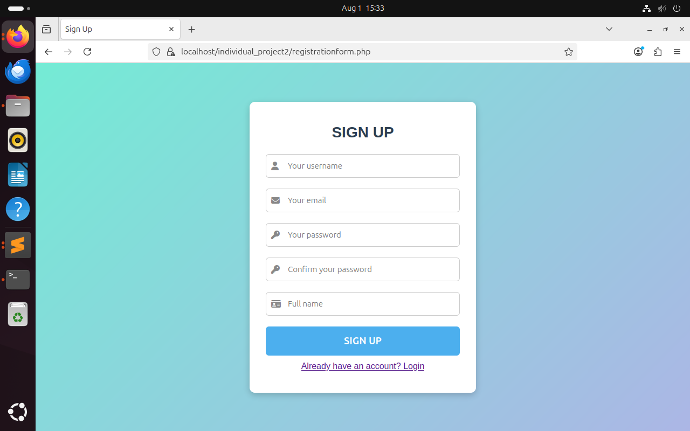
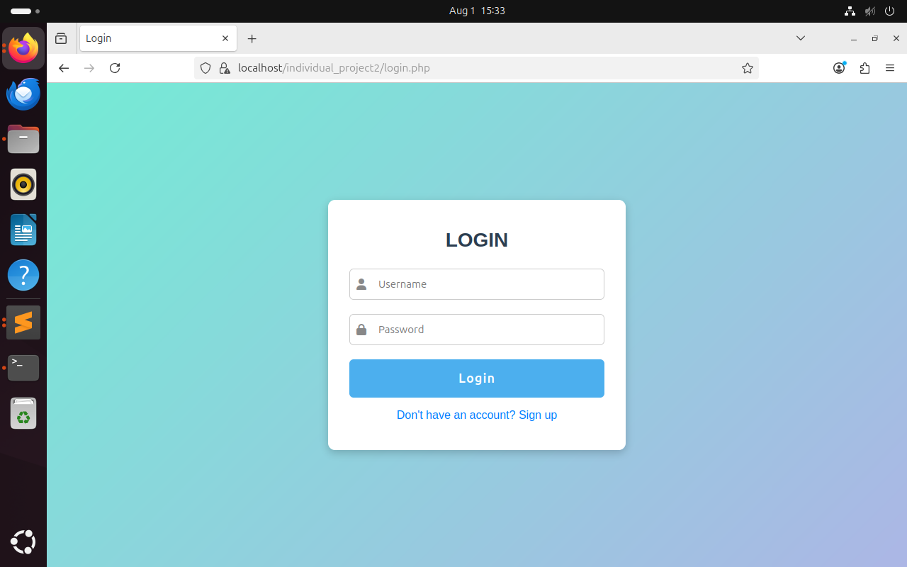
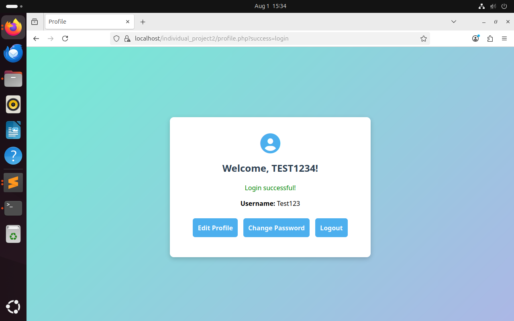
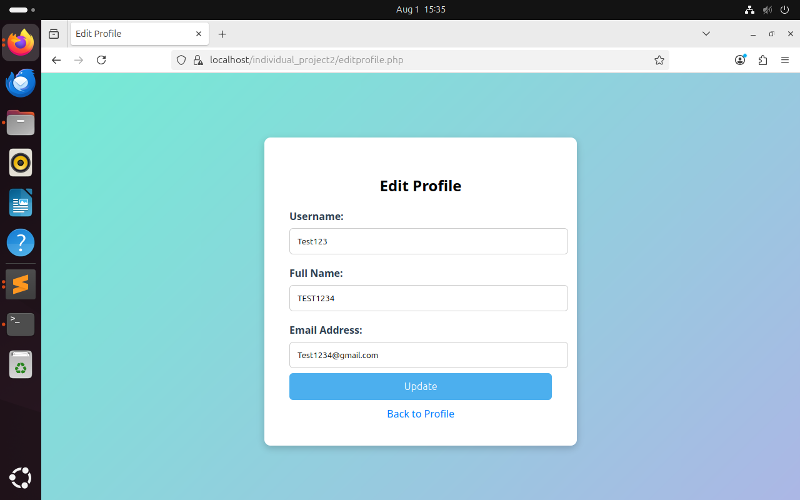
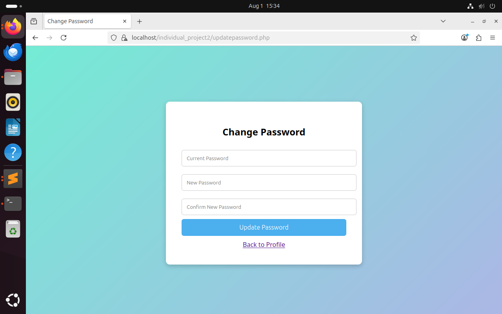

# Individual Project 2: Secure Full-Stack Web Application Development

**Course:** Web Application Programming and Hacking (WAPH)  
**Instructor:** Dr. Phu Phung  

**Student:** Arnab Singh  
**Email:** singha105@udayton.edu  

 


## **Overview**

In this project, I extended my knowledge from Labs 3 and 4 to develop a secure full-stack web application using **PHP and MySQL**.  
The application includes user registration, login, profile management, and password update functionalities.  

All features were implemented with a strong focus on **security**, including password hashing, prepared statements, CSRF protection, and secure session management.

**GitHub Repository:**  
[https://github.com/singha105/project2](https://github.com/singha105/project2)


## **Functional Requirements**

### **1. User Registration (15 pts)**

The user registration functionality was implemented using two files: **`registrationform.php`** (front-end form) and **`addnewuser.php`** (server-side processing).  

- **Registration Form (`registrationform.php`):**  
  - Designed a clean and user-friendly registration page using **HTML, CSS, and FontAwesome icons** for better usability.  
  - Implemented **client-side validation** using HTML5 attributes:  
    - `required` attributes ensure that no field can be left blank.  
    - `pattern="\w+"` for the username field ensures only letters, numbers, and underscores are allowed.  
    - `type="email"` is used for the email field to validate the email format automatically in the browser.  
  - Included fields for:  
    - Username  
    - Email address  
    - Password and Confirm Password  
    - Full Name  
  - A hidden **CSRF token** is generated on the server side and embedded in the form to prevent Cross-Site Request Forgery attacks.  

- **Server-Side Processing (`addnewuser.php`):**  
  - When the form is submitted, the data is sent via `POST` to `addnewuser.php` for processing.  
  - **CSRF Token Validation:** The script checks whether the submitted CSRF token matches the one stored in the user’s session. If it fails, the request is immediately terminated with a security error.  
  - **Server-Side Input Validation:**  
    - Ensures all fields are provided and not empty.  
    - Validates the email format using `filter_var()` with `FILTER_VALIDATE_EMAIL`.  
    - Checks whether the username already exists in the database using a prepared SQL statement. If the username is already taken, the user is redirected back with an error message.  
    - Ensures that the password and confirm password fields match.  
  - **Password Security:**  
    - Passwords are never stored as plain text.  
    - Before inserting the user into the database, the password is hashed using PHP’s `password_hash()` function with the default bcrypt algorithm.  
    - This ensures that even if the database is compromised, user passwords remain secure.  

- **Database Interaction:**  
  - Database operations use **prepared statements** with bound parameters to prevent SQL injection attacks.  
  - On successful validation, the user’s details (username, hashed password, name, and email) are inserted into the `users` table in the MySQL database.  

- **User Feedback and Redirection:**  
  - If registration is successful, the user is redirected to the `success.php` page, which confirms account creation.  
  - If any error occurs (e.g., username exists, invalid input, CSRF error), the user is redirected back to the registration page with a user-friendly error message displayed.

**Outcome:**  
The registration system allows new users to create accounts in a secure and robust manner. All potential attack vectors (e.g., CSRF, SQL injection, duplicate entries) are mitigated through a combination of server-side validation, prepared statements, CSRF token protection, and password hashing.  

**Screenshot:**  



### **2. Login (15 pts)**

The login functionality was implemented using two files: **`login.php`** (front-end login form and default landing page) and **`login_process.php`** (server-side processing).  

- **Login Form (`login.php`):**  
  - Serves as the **default landing page** for the application, ensuring users must log in before accessing any other features.  
  - Designed a clean and intuitive login form using **HTML, CSS, and FontAwesome icons**.  
  - The form accepts:
    - Username  
    - Password  
  - Includes a hidden **CSRF token** generated during the session to prevent Cross-Site Request Forgery attacks.  
  - Displays **error messages** for invalid login attempts and success messages after logout or session expiration.

- **Server-Side Processing (`login_process.php`):**  
  - Receives the `POST` data (username and password) from the login form.  
  - **CSRF Token Validation:** Validates that the submitted token matches the one stored in the user’s session.  
  - **Credential Verification:**  
    - Uses a prepared SQL statement to safely retrieve the hashed password for the entered username from the database.  
    - Uses PHP’s `password_verify()` to check the provided password against the stored hash.  
  - **Session Hardening:**  
    - On successful login, `session_regenerate_id()` is called to prevent session fixation attacks.  
    - The user’s browser information (`$_SERVER['HTTP_USER_AGENT']`) is stored and validated on each request to ensure session integrity.  
    - Implements **automatic session timeout** after 15 minutes of inactivity for additional security.  
  - If credentials are incorrect, the user is redirected back to the login form with an error message.

- **User Feedback:**  
  - Displays clear messages for:
    - Invalid username or password  
    - Session timeout (user is asked to log in again)  
    - Successful logout  

**Outcome:**  
The login system authenticates users securely using **password hashing**, **prepared statements**, and **session hardening techniques**. It ensures that only authenticated users can access protected resources and minimizes risks from session hijacking or brute force attacks.  

**Screenshot:**  



### **3. Profile Management (15 pts)**

The profile management functionality was implemented using two files: **`profile.php`** (viewing user profile information) and **`editprofile.php`** (updating profile details).  

- **Profile View (`profile.php`):**  
  - Displays the authenticated user’s **username, full name, and email address** in a clean, formatted layout.  
  - Accessible only by logged-in users; unauthenticated access redirects to the login page.  
  - Provides buttons or links to:
    - Edit Profile (`editprofile.php`)
    - Change Password (`updatepassword.php`)
    - Logout  

- **Edit Profile (`editprofile.php`):**  
  - Allows users to update their **username, full name, and email address**.  
  - Includes a hidden **CSRF token** to protect against CSRF attacks during the update process.  
  - Implements **input validation**:
    - All fields must be filled out.
    - Email address is validated with `filter_var()` using `FILTER_VALIDATE_EMAIL`.  
    - Username is validated with a regular expression (`^\w+$`) to allow only letters, numbers, and underscores.  
  - Checks for **duplicate usernames** in the database. If the updated username already exists (and is not the current user’s username), the user is shown a clear error message.  

- **Database Interaction:**  
  - Uses prepared SQL statements for all update queries to prevent SQL injection.  
  - Updates the `users` table with the new values only if validation passes and the CSRF token is valid.  

- **User Feedback:**  
  - Displays an error message if:
    - Required fields are missing  
    - Invalid email format  
    - Username already exists  
    - CSRF token validation fails  
  - Displays a success message or redirects the user to the profile page upon successful update.

**Outcome:**  
The profile management feature allows authenticated users to view and securely update their account details. All updates are protected with **CSRF tokens**, **input validation**, and **prepared statements**, ensuring robust security and user-friendly feedback.  

**Screenshot:**  



### **4. Password Update (15 pts)**

The password update functionality was implemented in **`updatepassword.php`**.  

- **Password Update Form:**  
  - Allows logged-in users to change their current password.  
  - Accessible only through the authenticated user’s session; direct access by unauthenticated users is blocked and redirected to the login page.  
  - The form contains the following fields:
    - Current Password  
    - New Password  
    - Confirm New Password  
  - A hidden **CSRF token** is included in the form to protect against Cross-Site Request Forgery attacks.

- **Server-Side Validation:**  
  - **CSRF Token Validation:** Checks that the submitted token matches the token stored in the user’s session. Requests without a valid token are rejected.  
  - **Password Verification:**  
    - Uses PHP’s `password_verify()` to check if the current password entered by the user matches the existing password hash stored in the database.  
    - If the current password is incorrect, the user is shown an appropriate error message and the update is not performed.  
  - **New Password Validation:**  
    - Ensures that both new password fields are not empty and match each other.  
    - (Optional) Additional validation could be added for password complexity (length, characters, etc.).  

- **Database Update:**  
  - If all validations pass, the new password is securely hashed using PHP’s `password_hash()` function.  
  - A prepared SQL statement is used to update the user’s password hash in the `users` table, preventing SQL injection attacks.  

- **User Feedback:**  
  - Displays error messages if:
    - The current password does not match.  
    - The new password and confirmation do not match.  
    - CSRF token validation fails.  
  - Displays a success message or redirects the user to their profile page after the password is updated successfully.

**Outcome:**  
The password update feature allows users to change their password in a secure and reliable way. This functionality is protected by **CSRF tokens**, **password hashing**, **prepared statements**, and **strict validation checks** to ensure account integrity.  

**Screenshot:**  



## **Security and Non-Technical Requirements**

### **1. Security (5 pts)**

- Application is deployed locally over **HTTPS** with a self-signed SSL certificate.  
- Passwords are securely hashed with `password_hash()`.  
- SQL Injection prevented using **prepared statements** in all queries.  
- MySQL root account is not used; instead, `ip2user` is used with least privilege.

### **2. Input Validation (5 pts)**

- Client-side: HTML5 attributes like `required`, `pattern`, and `type=email`.  
- Server-side: Validates email format, matching passwords, duplicate usernames.  
- Output is escaped using `htmlspecialchars()` to prevent XSS.

### **3. Database Design (5 pts)**

- MySQL database `ip2db` contains a `users` table with columns:
  - `username`, `password`, `name`, `email`.  
- Passwords stored only in **hashed format**.  
- Proper constraints and secure permissions applied.

### **4. Front-End Development (5 pts)**

- Forms styled with CSS for a professional UI.  
- Icons added for better UX using FontAwesome.  
- Responsive layout with consistent button and input styling.

### **5. Session Management (5 pts)**

- Sessions use `session_regenerate_id()` on login.  
- Session timeout implemented: auto logout after 15 minutes of inactivity.  
- Session tied to the user’s browser `HTTP_USER_AGENT`.

### **6. CSRF Protection (5 pts)**

- All forms that modify data include a CSRF token:
  - `registrationform.php`
  - `editprofile.php`
  - `updatepassword.php`
- Tokens validated on the server side before processing.


### **Demonstration Video**

Below is the link to the demonstration video showcasing the features and functionality of the project:

 [Watch the Demo Video](https://drive.google.com/file/d/1N8R8BwHFV5tRxTDkMX9Wxt2XgncL-7k3/view?usp=sharing)


## **Appendix: Code**
- All project code is available in the **GitHub repository**:  
  [https://github.com/singha105/project2](https://github.com/singha105/project2)

### **Registration Form (`registrationform.php`)**

```php
<?php
session_start();

// Create CSRF token if not exists
if (empty($_SESSION['csrf_token'])) {
    $_SESSION['csrf_token'] = bin2hex(random_bytes(32));
}
?>

<!DOCTYPE html>
<html lang="en">
<head>
    <meta charset="UTF-8">
    <title>Sign Up</title>
    <link rel="stylesheet" href="https://cdnjs.cloudflare.com/ajax/libs/font-awesome/6.5.0/css/all.min.css">
    <style>
        * { margin:0; padding:0; box-sizing: border-box; }
        html,body { height:100%; width:100%; }
        body {
            background: linear-gradient(135deg, #74ebd5, #ACB6E5);
            font-family: 'Segoe UI', Arial, sans-serif;
            display: flex; justify-content: center; align-items: center;
        }
        .container { 
            background:#fff; width:420px; padding:40px 30px; 
            border-radius:10px; box-shadow:0 4px 12px rgba(0,0,0,0.2); 
            text-align:center; 
        }
        .container h2 { margin-bottom:25px; font-size:28px; color:#2c3e50; }
        .input-group { position:relative; margin-bottom:20px; }
        .input-group i { 
            position:absolute; top:50%; left:10px; transform:translateY(-50%); 
            color:#888; font-size:16px; 
        }
        .input-group input, .full-name-input {
            width:100%; padding:12px 12px 12px 40px; 
            border:1px solid #ccc; border-radius:6px; 
            font-size:15px; 
        }
        .btn { 
            background:#4CAFEE; color:#fff; border:none; width:100%; 
            padding:16px; border-radius:6px; font-size:18px; 
            font-weight:bold; cursor:pointer; transition:0.3s; 
        }
        .btn:hover { background:#3a94d9; transform:scale(1.04); }
        .message { color:red; margin-bottom:10px; }
    </style>
</head>
<body>
    <div class="container">
        <h2>SIGN UP</h2>
        <?php if (isset($_GET['error'])): ?>
            <p class="message">
                <?php if ($_GET['error'] == 'csrf') echo "Security check failed. Please try again."; ?>
                <?php if ($_GET['error'] == 'exists') echo "Username already exists."; ?>
                <?php if ($_GET['error'] == 'invalid') echo "Invalid input. Please try again."; ?>
            </p>
        <?php endif; ?>
        <form method="post" action="addnewuser.php">
            <input type="hidden" name="csrf_token" value="<?php echo $_SESSION['csrf_token']; ?>">
            <div class="input-group">
                <i class="fa fa-user"></i>
                <input type="text" name="username" placeholder="Your username" required pattern="\w+">
            </div>
            <div class="input-group">
                <i class="fa fa-envelope"></i>
                <input type="email" name="email" placeholder="Your email" required>
            </div>
            <div class="input-group">
                <i class="fa fa-key"></i>
                <input type="password" name="password" placeholder="Your password" required>
            </div>
            <div class="input-group">
                <i class="fa fa-key"></i>
                <input type="password" name="confirm_password" placeholder="Confirm your password" required>
            </div>
            <!-- Full name styled same as others -->
            <div class="input-group">
                <i class="fa fa-id-card"></i>
                <input type="text" class="full-name-input" name="name" placeholder="Full name" required>
            </div>
            <button type="submit" class="btn">SIGN UP</button>
        </form>
        <a href="login.php" style="display:block;margin-top:10px;">Already have an account? Login</a>
    </div>
</body>
</html>
```

### **Add User (`addnewuser.php`)**

```php
<?php
session_start();
require_once "includes/db.php";

if ($_SERVER["REQUEST_METHOD"] == "POST") {
    // CSRF token validation
    if (!isset($_POST['csrf_token']) || $_POST['csrf_token'] !== $_SESSION['csrf_token']) {
        header("Location: registrationform.php?error=csrf");
        exit();
    }

    // Sanitize and validate input
    $username = trim($_POST['username']);
    $password = trim($_POST['password']);
    $confirm_password = trim($_POST['confirm_password']);
    $name = trim($_POST['name']);
    $email = trim($_POST['email']);

    if (empty($username) || empty($password) || empty($confirm_password) || empty($name) || empty($email)) {
        header("Location: registrationform.php?error=invalid");
        exit();
    }
    if (!filter_var($email, FILTER_VALIDATE_EMAIL) || $password !== $confirm_password) {
        header("Location: registrationform.php?error=invalid");
        exit();
    }

    // Check if username exists
    $stmt = $pdo->prepare("SELECT username FROM users WHERE username = :username");
    $stmt->execute(['username' => $username]);
    if ($stmt->rowCount() > 0) {
        header("Location: registrationform.php?error=exists");
        exit();
    }

    // Hash password and insert user
    $hashed_password = password_hash($password, PASSWORD_DEFAULT);
    $stmt = $pdo->prepare("INSERT INTO users (username, password, name, email) VALUES (:username, :password, :name, :email)");
    $stmt->execute([
        'username' => $username,
        'password' => $hashed_password,
        'name' => $name,
        'email' => $email
    ]);

    // Clear CSRF token and redirect to success
    unset($_SESSION['csrf_token']);
    header("Location: success.php");
    exit();
} else {
    echo "Invalid request!";
}
?>
```

### **Login Form (`login.php`)**

```php
<?php
session_start();

// Create CSRF token if not exists
if (empty($_SESSION['csrf_token'])) {
    $_SESSION['csrf_token'] = bin2hex(random_bytes(32));
}
?>
<!DOCTYPE html>
<html lang="en">
<head>
    <meta charset="UTF-8">
    <title>Login</title>
    <link rel="stylesheet" href="https://cdnjs.cloudflare.com/ajax/libs/font-awesome/6.5.0/css/all.min.css">
    <style>
        * { margin:0; padding:0; box-sizing: border-box; }
        html, body { height:100%; width:100%; }
        body {
            background: linear-gradient(135deg, #74ebd5, #ACB6E5);
            font-family: 'Segoe UI', Arial, sans-serif;
            display:flex; justify-content:center; align-items:center;
        }
        .container {
            background:#ffffff;
            width:420px;
            padding:40px 30px;
            border-radius:10px;
            box-shadow:0 4px 12px rgba(0,0,0,0.2);
            text-align:center;
        }
        .container h2 { margin-bottom:25px; font-size:28px; color:#2c3e50; }
        .message { margin-bottom:15px; font-size:15px; }
        .error { color:red; }
        .success { color:green; }

        .input-group { position:relative; margin-bottom:20px; }
        .input-group i {
            position:absolute; top:50%; left:10px;
            transform:translateY(-50%); color:#888; font-size:16px;
        }
        .input-group input {
            width:100%; padding:12px 12px 12px 40px;
            border:1px solid #ccc; border-radius:6px; font-size:15px;
            outline:none;
        }
        .btn {
            background:#4CAFEE; color:#fff; border:none; width:100%;
            padding:16px; border-radius:6px; font-size:18px; font-weight:bold;
            cursor:pointer; letter-spacing:1px; transition:background 0.3s, transform 0.2s;
        }
        .btn:hover { background:#3a94d9; transform:scale(1.04); }
        .link { margin-top:15px; display:block; color:#007BFF; text-decoration:none; }
        .link:hover { text-decoration:underline; }
    </style>
</head>
<body>
    <div class="container">
        <h2>LOGIN</h2>

        <!-- Error and Success Messages -->
        <?php if (isset($_GET['error'])): ?>
            <p class="message error">
                <?php if ($_GET['error'] == 'invalid') echo "Invalid password. Please try again."; ?>
                <?php if ($_GET['error'] == 'notfound') echo "Username not found."; ?>
                <?php if ($_GET['error'] == 'session') echo "Session expired or invalid. Please log in again."; ?>
                <?php if ($_GET['error'] == 'timeout') echo "You were logged out due to inactivity."; ?>
            </p>
        <?php endif; ?>

        <?php if (isset($_GET['success']) && $_GET['success'] == 'logout'): ?>
            <p class="message success">You have successfully logged out.</p>
        <?php endif; ?>

        <form method="post" action="login_process.php">
            <input type="hidden" name="csrf_token" value="<?php echo $_SESSION['csrf_token']; ?>">
            <div class="input-group">
                <i class="fa fa-user"></i>
                <input type="text" name="username" placeholder="Username" required>
            </div>
            <div class="input-group">
                <i class="fa fa-lock"></i>
                <input type="password" name="password" placeholder="Password" required>
            </div>
            <button type="submit" class="btn">Login</button>
        </form>

        <a href="registrationform.php" class="link">Don't have an account? Sign up</a>
    </div>
</body>
</html>
```

### **Login Process (`login_process.php`)**

```php
<?php
session_start();
ini_set('display_errors', 1);
error_reporting(E_ALL);

require_once "includes/db.php";

if ($_SERVER["REQUEST_METHOD"] == "POST") {
    $username = trim($_POST['username']);
    $password = trim($_POST['password']);

    $stmt = $pdo->prepare("SELECT username, password, name FROM users WHERE username = :username");
    $stmt->execute(['username' => $username]);

    if ($stmt->rowCount() === 1) {
        $user = $stmt->fetch(PDO::FETCH_ASSOC);

        if (password_verify($password, $user['password'])) {
            // Session hardening
            session_regenerate_id(true);
            $_SESSION['username'] = $user['username'];
            $_SESSION['name'] = $user['name'];
            $_SESSION['user_agent'] = $_SERVER['HTTP_USER_AGENT'];

            // CSRF token
            $_SESSION['csrf_token'] = bin2hex(random_bytes(32));

            header("Location: profile.php?success=login");
            exit();
        } else {
            header("Location: login.php?error=invalid");
            exit();
        }
    } else {
        header("Location: login.php?error=notfound");
        exit();
    }
} else {
    echo "Invalid request!";
}
?>
```

### **Registration Success (`success.php`)**

```html
<!DOCTYPE html>
<html lang="en">
<head>
    <meta charset="UTF-8">
    <title>Registration Successful</title>
    <link rel="stylesheet" href="https://cdnjs.cloudflare.com/ajax/libs/font-awesome/6.5.0/css/all.min.css">

    <style>
        /* Same style as registration page */
        * {
            margin: 0;
            padding: 0;
            box-sizing: border-box;
        }

        html, body {
            height: 100%;
            width: 100%;
        }

        body {
            background: linear-gradient(135deg, #74ebd5, #ACB6E5);
            font-family: 'Segoe UI', Arial, sans-serif;
            display: flex;
            justify-content: center;
            align-items: center;
        }

        .container {
            background: #ffffff;
            width: 420px;
            padding: 40px 30px;
            border-radius: 10px;
            box-shadow: 0 4px 12px rgba(0, 0, 0, 0.2);
            text-align: center;
        }

        .container h2 {
            color: #2c3e50;
            margin-bottom: 20px;
        }

        .container p {
            font-size: 16px;
            margin-bottom: 20px;
        }

        .btn {
            background: #4CAFEE;
            color: #fff;
            border: none;
            width: 100%;
            padding: 16px;
            border-radius: 6px;
            font-size: 18px;
            font-weight: bold;
            cursor: pointer;
            text-decoration: none;
            display: inline-block;
        }

        .btn:hover {
            background: #3a94d9;
            transform: scale(1.04);
        }

        .icon {
            color: #4CAF50;
            font-size: 50px;
            margin-bottom: 15px;
        }
    </style>
</head>
<body>
    <div class="container">
        <i class="fa-solid fa-circle-check icon"></i>
        <h2>Registration Successful!</h2>
        <p>You have successfully signed up.</p>
        <a href="login.php" class="btn">Go to Login</a>
    </div>
</body>
</html>
```

### **Profile Page (`profile.php`)**

```php
<?php
session_start();

// Session timeout - 15 minutes
$timeout = 15 * 60; // 900 seconds

if (isset($_SESSION['last_activity']) && (time() - $_SESSION['last_activity']) > $timeout) {
    session_unset();
    session_destroy();
    header("Location: login.php?error=timeout");
    exit();
}
$_SESSION['last_activity'] = time();


if (!isset($_SESSION['username']) || $_SESSION['user_agent'] !== $_SERVER['HTTP_USER_AGENT']) {
    session_unset();
    session_destroy();
    header("Location: login.php?error=session");
    exit();
}

if (empty($_SESSION['csrf_token'])) {
    $_SESSION['csrf_token'] = bin2hex(random_bytes(32));
}
?>
<!DOCTYPE html>
<html lang="en">
<head>
    <meta charset="UTF-8">
    <title>Profile</title>
    <link rel="stylesheet" href="https://cdnjs.cloudflare.com/ajax/libs/font-awesome/6.5.0/css/all.min.css">
    <style>
        body { background: linear-gradient(135deg, #74ebd5, #ACB6E5); font-family: 'Segoe UI', sans-serif; display:flex; align-items:center; justify-content:center; height:100vh; }
        .container { background:#fff; padding:40px; border-radius:10px; text-align:center; width:420px; box-shadow:0 4px 12px rgba(0,0,0,0.2); }
        .container h2 { margin-bottom:20px; color:#2c3e50; }
        .btn { display:inline-block; margin:10px 5px; background:#4CAFEE; color:#fff; padding:12px; border:none; border-radius:6px; text-decoration:none; font-weight:bold; }
        .btn:hover { background:#3a94d9; }
        .message { margin-bottom:10px; color:green; }
    </style>
</head>
<body>
    <div class="container">
        <i class="fa-solid fa-user-circle" style="font-size:50px; color:#4CAFEE;"></i>
        <h2>Welcome, <?php echo htmlspecialchars($_SESSION['name']); ?>!</h2>
        <?php if (isset($_GET['success'])): ?>
            <p class="message">
                <?php if ($_GET['success'] == 'login') echo "Login successful!"; ?>
                <?php if ($_GET['success'] == 'profile') echo "Profile updated!"; ?>
                <?php if ($_GET['success'] == 'password') echo "Password changed!"; ?>
            </p>
        <?php endif; ?>
        <p><strong>Username:</strong> <?php echo htmlspecialchars($_SESSION['username']); ?></p>
        <a href="editprofile.php" class="btn">Edit Profile</a>
        <a href="updatepassword.php" class="btn">Change Password</a>
        <a href="logout.php" class="btn">Logout</a>
    </div>
</body>
</html>
```

### **Logout (`logout.php`)**

```php
<?php
session_start();
session_unset();
session_destroy();
header("Location: login.php");
exit();
?>
```

### **Edit Profile (`editprofile.php`)**

```php
<?php
session_start();

// Session timeout - 15 minutes
$timeout = 15 * 60; // 900 seconds

if (isset($_SESSION['last_activity']) && (time() - $_SESSION['last_activity']) > $timeout) {
    session_unset();
    session_destroy();
    header("Location: login.php?error=timeout");
    exit();
}
$_SESSION['last_activity'] = time();

require_once "includes/db.php";

if (!isset($_SESSION['username']) || $_SESSION['user_agent'] !== $_SERVER['HTTP_USER_AGENT']) {
    session_unset();
    session_destroy();
    header("Location: login.php?error=session");
    exit();
}

$current_username = $_SESSION['username'];

if ($_SERVER["REQUEST_METHOD"] == "POST") {
    if (!isset($_POST['csrf_token']) || $_POST['csrf_token'] !== $_SESSION['csrf_token']) {
        die("CSRF token validation failed");
    }

    $username = trim($_POST['username']);
    $name = trim($_POST['name']);
    $email = trim($_POST['email']);

    if (empty($username) || empty($name) || empty($email)) {
        $error = "All fields are required.";
    } elseif (!preg_match("/^\w+$/", $username)) {
        $error = "Username can only contain letters, numbers, and underscores.";
    } elseif (!filter_var($email, FILTER_VALIDATE_EMAIL)) {
        $error = "Invalid email format.";
    } else {
        // Check if username already exists (and is not the current one)
        $check_stmt = $pdo->prepare("SELECT username FROM users WHERE username = :username AND username != :current");
        $check_stmt->execute(['username' => $username, 'current' => $current_username]);

        if ($check_stmt->rowCount() > 0) {
            $error = "Username is already taken.";
        } else {
            // Update user details
            $stmt = $pdo->prepare("UPDATE users SET username = :username, name = :name, email = :email WHERE username = :current");
            $stmt->execute([
                'username' => $username,
                'name' => $name,
                'email' => $email,
                'current' => $current_username
            ]);

            // Update session username if changed
            $_SESSION['username'] = $username;
            $_SESSION['name'] = $name;

            header("Location: profile.php?success=profile");
            exit();
        }
    }
}

// Fetch user details for display
$stmt = $pdo->prepare("SELECT username, name, email FROM users WHERE username = :username");
$stmt->execute(['username' => $current_username]);
$user = $stmt->fetch(PDO::FETCH_ASSOC);
?>
<!DOCTYPE html>
<html>
<head>
    <meta charset="UTF-8">
    <title>Edit Profile</title>
    <style>
        body { 
            background: linear-gradient(135deg, #74ebd5, #ACB6E5); 
            font-family: 'Segoe UI', sans-serif; 
            display:flex; align-items:center; justify-content:center; 
            height:100vh; 
        }
        .container { 
            background:#fff; padding:40px; border-radius:10px; 
            text-align:center; width:420px; 
            box-shadow:0 4px 12px rgba(0,0,0,0.2); 
        }
        label { 
            display:block; text-align:left; font-weight:bold; 
            margin-top:10px; color:#2c3e50; 
        }
        input { 
            width:100%; padding:12px; margin:8px 0; 
            border-radius:6px; border:1px solid #ccc; 
        }
        .btn { 
            background:#4CAFEE; color:#fff; padding:12px; 
            border:none; border-radius:6px; font-size:16px; 
            cursor:pointer; width:100%; 
        }
        .btn:hover { background:#3a94d9; }
        .error { color:red; margin-bottom:10px; }
        a { display:block; margin-top:10px; text-decoration:none; color:#007BFF; }
        a:hover { text-decoration:underline; }
    </style>
</head>
<body>
    <div class="container">
        <h2>Edit Profile</h2>
        <?php if (isset($error)) echo "<p class='error'>$error</p>"; ?>
        <form method="post">
            <input type="hidden" name="csrf_token" value="<?php echo $_SESSION['csrf_token']; ?>">

            <label for="username">Username:</label>
            <input type="text" id="username" name="username" 
                   value="<?php echo htmlspecialchars($user['username']); ?>" required>

            <label for="name">Full Name:</label>
            <input type="text" id="name" name="name" 
                   value="<?php echo htmlspecialchars($user['name']); ?>" required>

            <label for="email">Email Address:</label>
            <input type="email" id="email" name="email" 
                   value="<?php echo htmlspecialchars($user['email']); ?>" required>

            <button type="submit" class="btn">Update</button>
        </form>
        <a href="profile.php">Back to Profile</a>
    </div>
</body>
</html>
```

### **Update Password (`updatepassword.php`)**

```php
<?php
session_start();

// Session timeout - 15 minutes
$timeout = 15 * 60; // 900 seconds

if (isset($_SESSION['last_activity']) && (time() - $_SESSION['last_activity']) > $timeout) {
    session_unset();
    session_destroy();
    header("Location: login.php?error=timeout");
    exit();
}
$_SESSION['last_activity'] = time();


require_once "includes/db.php";

if (!isset($_SESSION['username']) || $_SESSION['user_agent'] !== $_SERVER['HTTP_USER_AGENT']) {
    session_unset();
    session_destroy();
    header("Location: login.php?error=session");
    exit();
}

$username = $_SESSION['username'];

if ($_SERVER["REQUEST_METHOD"] == "POST") {
    if (!isset($_POST['csrf_token']) || $_POST['csrf_token'] !== $_SESSION['csrf_token']) {
        die("CSRF token validation failed");
    }

    $current_password = trim($_POST['current_password']);
    $new_password = trim($_POST['new_password']);
    $confirm_password = trim($_POST['confirm_password']);

    if (empty($current_password) || empty($new_password) || empty($confirm_password)) {
        $error = "All fields are required.";
    } elseif ($new_password !== $confirm_password) {
        $error = "New passwords do not match.";
    } else {
        $stmt = $pdo->prepare("SELECT password FROM users WHERE username = :username");
        $stmt->execute(['username' => $username]);
        $user = $stmt->fetch(PDO::FETCH_ASSOC);

        if ($user && password_verify($current_password, $user['password'])) {
            $hashed_password = password_hash($new_password, PASSWORD_DEFAULT);
            $update_stmt = $pdo->prepare("UPDATE users SET password = :password WHERE username = :username");
            $update_stmt->execute(['password' => $hashed_password, 'username' => $username]);
            header("Location: profile.php?success=password");
            exit();
        } else {
            $error = "Current password is incorrect.";
        }
    }
}
?>
<!DOCTYPE html>
<html>
<head>
    <meta charset="UTF-8">
    <title>Change Password</title>
    <style>
        body { background: linear-gradient(135deg, #74ebd5, #ACB6E5); font-family: 'Segoe UI', sans-serif; display:flex; align-items:center; justify-content:center; height:100vh; }
        .container { background:#fff; padding:40px; border-radius:10px; text-align:center; width:420px; box-shadow:0 4px 12px rgba(0,0,0,0.2); }
        input { width:100%; padding:12px; margin:10px 0; border-radius:6px; border:1px solid #ccc; }
        .btn { background:#4CAFEE; color:#fff; padding:12px; border:none; border-radius:6px; font-size:16px; cursor:pointer; width:100%; }
        .btn:hover { background:#3a94d9; }
        .error { color:red; margin-bottom:10px; }
    </style>
</head>
<body>
    <div class="container">
        <h2>Change Password</h2>
        <?php if (isset($error)) echo "<p class='error'>$error</p>"; ?>
        <form method="post">
            <input type="hidden" name="csrf_token" value="<?php echo $_SESSION['csrf_token']; ?>">
            <input type="password" name="current_password" placeholder="Current Password" required>
            <input type="password" name="new_password" placeholder="New Password" required>
            <input type="password" name="confirm_password" placeholder="Confirm New Password" required>
            <button type="submit" class="btn">Update Password</button>
        </form>
        <a href="profile.php" style="display:block;margin-top:10px;">Back to Profile</a>
    </div>
</body>
</html>
```
### **Database Setup Script (`database.sql`)**

```sql
-- Create the database
CREATE DATABASE ip2db CHARACTER SET utf8mb4 COLLATE utf8mb4_unicode_ci;

-- Use the database
USE ip2db;

-- Create the users table
CREATE TABLE `users` (
  `id` int NOT NULL AUTO_INCREMENT,
  `username` varchar(50) NOT NULL,
  `password` varchar(255) NOT NULL,
  `name` varchar(100) DEFAULT NULL,
  `email` varchar(100) DEFAULT NULL,
  `created_at` timestamp NULL DEFAULT CURRENT_TIMESTAMP,
  PRIMARY KEY (`id`),
  UNIQUE KEY `username` (`username`)
) ENGINE=InnoDB DEFAULT CHARSET=utf8mb4 COLLATE=utf8mb4_0900_ai_ci;

```

### **Database Connection (`includes/db.php`)**

```php
<?php
$host = "localhost";
$dbname = "ip2db";
$username = "ip2user";
$password = "securepassword";

try {
    $pdo = new PDO("mysql:host=$host;dbname=$dbname;charset=utf8", $username, $password);
    $pdo->setAttribute(PDO::ATTR_ERRMODE, PDO::ERRMODE_EXCEPTION);
} catch (PDOException $e) {
    die("Database connection failed: " . $e->getMessage());
}
?>
```

